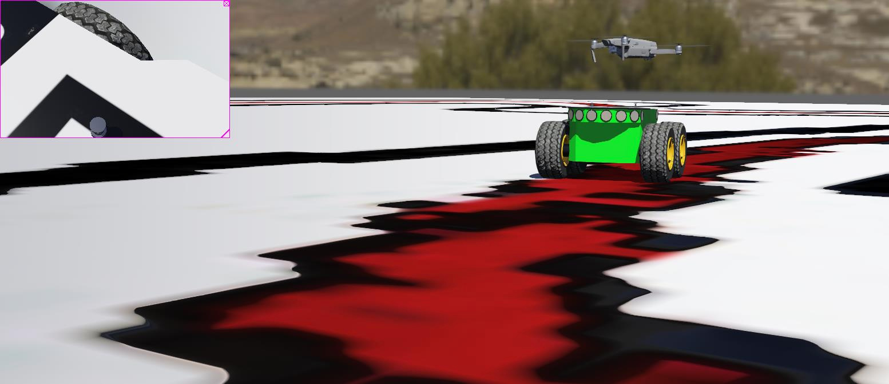

# Webots-Quadcopter-Python-SITL

_Note: This repository is under heavy development right now (and will likely be available by December 2019)._

## Background

A couple of years ago, I had authored a paper on object tracking Quadcopter. (Link: https://www.academia.edu/40403950/Single_Horizontal_Camera-Based_Object_Tracking_Quadcopter_Using_StaGaus_Algorithm ) I had some difficulties with reproducible results (with physical drone as mentioned in the paper). However, back then, I ended up building a ROS and Gazebo based multi-type multi-vehicle SITL (Software In The Loop) simulator (as detailed in the paper). The setup was extensive and worked only with a specific version of Ubuntu (requiring `sudo` and root access).

Also, few of the repositories have been archived now and I believe Erle Robotics has shut down completely and their github repositories are archived (which means that my ROS Gazebo SITL simulator may/may not be fully reproducible. At least, it won't be easy to reproduce my research to say the least).

**_However, this simulator is a general purpose object tracking simulator and is not restricted to my research paper. My intention is to advance the standardisation of reinforcement learning, deep learning and the likes and make it simpler to achieve it._**

## Solution

1. Building a cross-platform compatible (main target OS being Windows, Linux and Mac OS) with pure Python implementation of controllers for multi-type, multi-vehicle SITL simulator. As I could not find anything like this yet for object tracking in Webots, I started out with Mavic 2 Pro Quadcopter and Pioneer 3DX rover.

2. I also wrote pure Python SITL Flight Controller (for waypoint navigation) as I could not find pure general purpose quadcopter controller in Python for SITL. It can also be used in hardware (and it is general purpose code, so, it will work with all hardwares that can run Python interpreter).

  

## Installation instructions

1. Install Webots (according to your OS).  
Link: https://cyberbotics.com/download

2. Install Python (according to your OS).  
Note: Any of the versions of Python supported by Webots is needed.  
Link: https://cyberbotics.com/doc/guide/using-python

3. Install libraries needed to run this simulation.  
 a. `pip install simple-pid`  Source: https://github.com/m-lundberg/simple-pid  
 b. `pip install numpy`  
 c. Install Python OpenCV.  
   - `pip install opencv-contrib-python` (Preferred. However, this installs opencv-contrib which may contain patented algorithms. Unofficial community whl)
   - `pip install opencv-python` (Unofficial community whl)
   - Downloading source code from https://opencv.org and compiling (or checking if cv2.py or something like python2_cv.py and python3_cv.py files are present after downloading OpenCV exe executables (for Windows users only)). This method requires compilation and is not recommended unless performance is needed in simulations and it takes some time to install.
   - Ubuntu and linux users may be able to install OpenCV via system package managers like `apt`, `aptitude` etc.

## Running the simulator

Just double click on (or run) _Webots-Quadcopter-Python-SITL/blob/master/worlds/empty.wbt_